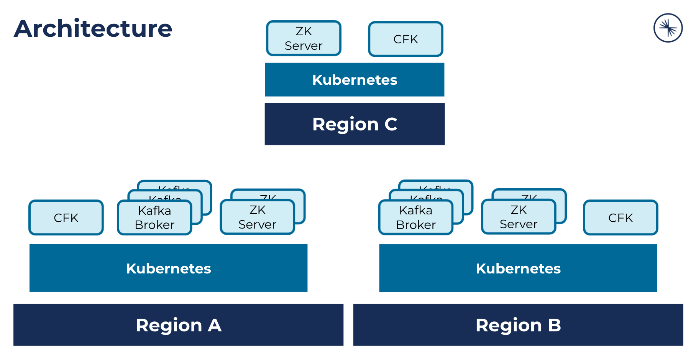

# Confluent Multi-Region Clusters (MRC) with Confluent for Kubernetes (CFK)

Confluent Server is often run across availability zones or nearby datacenters. If the computer network between brokers across availability zones or nearby datacenters is dissimilar, in term of reliability, latency, bandwidth, or cost, this can result in higher latency, lower throughput and increased cost to produce and consume messages.

To mitigate this, Multi-Region Cluster functionality was added to Confluent Server. Read more about this functionality [here](https://docs.confluent.io/platform/current/multi-dc-deployments/multi-region.html).

In this scenario workflow, you'll understand the concepts and how to set up a multi-region cluster.

## Concepts

At a high level, you'll deploy Confluent for Kubernetes (CFK) and Confluent Platform across multiple Kubernetes clusters.

There are two key concepts to understand:

- Networking between Kubernetes clusters
- Zookeeper, Confluent Server (Kafka) and Schema Registry deployment with Multi-Region cluster configuration

### Networking

To support Multi-Region Clusters with Confluent for Kubernetes, you'll need to meet one of the following set of requirements in your Kubernetes architecture:

**Using internal listeners**
- Pods in one Kubernetes cluster can resolve the internal Kubernetes network DNS names for pods in the other Kubernetes clusters
- Pods in one Kubernetes cluster can communicate with pods in the other Kubernetes clusters

**Using external access**
- Zookeeper and Kafka are configured to use external access to communicate across different regions, removing the requirement to change your Kubernetes networking configuration
- If Schema Registry is set up in active-passive mode, it will also need to be configured to communicate with external access across regions

There may be multiple ways to achieve these requirements. How you meet these requirements will depend on your infrastructure setup and Kubernetes vendor. 
In the subfolders for `internal-listeners` and `external-access`, you'll see a few illustrative networking solutions for these requirements for both scenarios that you can follow along.

### Zookeeper, Confluent Server (Kafka) and Schema Registry deployment

To support Multi-Region Clusters with Confluent for Kubernetes, you'll take the following steps:

- Deploy Confluent for Kubernetes to each region
- For Zookeeper
  - Deploy Zookeeper servers to 3 regions
  - Configure ZK server id offset to a different number in each region
  - Configure ZK peers that form the ensemble
- For Kafka
  - Deploy Kafka brokers to 3 regions
  - Configure the broker id offset to a different number in each region
  - Configure the Kafka cluster id as the same across all (point to the same Zookeeper)
- For Schema Registry
  - Deploy Schema Registry to 3 regions
  - Override `kafkastore.topic` to point to the same topic in all the regions
  - Override `schema.registry.group.id` to have the same value in all the regions